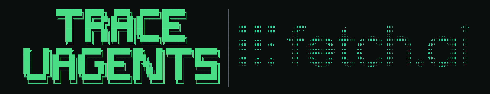

<p align="center">
  
</p>

# trace-uagents

Drop-in, read-only observability for [uAgents](https://github.com/fetchai/uAgents) message
flow. It records spans for sends and receives to a local SQLite file and shows them live
in the terminal as a diagram — so you can see what got delivered, what timed out, and what
got dropped, without adding logging statements or changing how your agents behave.

It does not modify agent behavior, generate code, or scaffold anything. It only records
and displays.

## Install

```bash
pip install -e .
```

## Quick start (2 steps)

**1. Instrument your agents** — wrap sends and handlers:

```python
from uagents_trace import trace, traced_send

await traced_send(ctx, dest, msg)   # instead of ctx.send

@agent.on_message(model=MyModel)
@trace                              # must be the inner decorator
async def handler(ctx, sender, msg): ...
```

**2. Watch messages live** — in another terminal:

```bash
uagents-trace
```

You'll be asked a few questions (how many agents, their seeds, friendly names like
"Orchestrator" or "Alice") — no long commands to type. Then a live diagram opens showing
messages as they flow between agents, with the full message text.

Press `q` to quit, `f` to toggle following the latest trace, `v` to switch between the
linear and tree layouts for hub (fan-out) traces.

## What the live view shows

**The diagram.** Each trace renders as either a peer exchange (two agents, one arrow) or
a hub fan-out (one orchestrator, several sub-agents, drawn as a tree). Box color and the
status glyph underneath it (✓ / ⚠ / ✗) track delivery state per leg; a box gets a double
border while its agent is selected. The diagram scrolls horizontally instead of squeezing
itself to fit, so a wide fan-out trace never overlaps its own boxes.

**The trace list.** Each row carries a stable number (oldest trace is 1; it never changes
as newer traces arrive above it), a completion fraction, and a latency bar. The bar's fill
color encodes speed — green, amber, red — independently of whether the trace succeeded, so
a fast trace that still failed shows a green bar next to red failure text, and a slow
success shows a red bar next to green text.

**The inspector.** Click an agent box to see everything recorded about that leg: its full
address (not just the short alias), the message and protocol (plus any protocol-specific
detail — a Payment amount, a rejection reason), a timing table with both trace-relative
deltas and the absolute wall-clock send time, delivery/registration status, and the raw
error if it failed. Below that, a session-stats footer summarizes every trace currently
loaded — trace and agent counts, overall success rate, slowest/fastest/average duration,
and the most common failure reason — so you get session-wide context without leaving the
agent you clicked into.

Before you've clicked anything, that same session summary fills the inspector on its own,
under an animated version of the logo and a link to star the repo on GitHub.

**The feed.** A rolling log of the last several messages across the active trace, each
line colored by outcome.

## Run the example

**Terminal 1** — start demo agents:

```bash
python examples/two_agents.py
```

**Terminal 2** — run the interactive viewer:

```bash
uagents-trace
```

Answer the setup questions using the demo seeds (`uagents_trace_demo_agent_a_seed`,
`uagents_trace_demo_agent_b_seed`) and names like `AgentA` / `AgentB`.

Other examples worth running the same way:

- `examples/orchestrator_fanout.py` — one orchestrator dispatching to four sub-agents, a
  hub-shaped trace, with one leg deliberately unreachable so you can see a failed leg.
- `examples/payment_flow.py` — the real uAgents Payment Protocol (RequestPayment →
  CommitPayment → CompletePayment, with some requests rejected), showing protocol
  recognition and the inspector's protocol-detail field.
- `examples/chat_session.py` — the real uAgents Chat Protocol, showing spans labeled
  "Chat Protocol" and grouped by session instead of by bare class name.

## Instrumentation details

Decorator order matters: `agent.on_message(...)` captures whichever function sits directly
beneath it at decoration time, so `trace` must be the *inner* decorator:

```python
@agent.on_message(model=MyModel)
@trace
async def handler(ctx, sender, msg): ...
```

Reversing the order makes uAgents register the untraced handler directly and the wrapper
silently never runs.

Each call records a span, then updates it to `delivered`, `dropped`, or `timeout` once
the outcome is known. Spans are correlated into a trace using the uAgents session id.
Chat Protocol and Payment Protocol messages are recognized automatically and labeled
accordingly, with protocol-specific context (amounts, rejection reasons) attached.

## Advanced commands

For power users, these still work:

```bash
uagents-trace list                  # table of recent traces
uagents-trace show                  # ASCII waterfall for the latest trace
uagents-trace show <trace_id>       # ...for a specific trace (prefix match ok)
uagents-trace show --view tree      # fan-out branches instead of stacked rows
uagents-trace watch                 # re-render the most recent trace every ~1s
uagents-trace tui                   # simpler table-based live viewer
uagents-trace alias add Name --seed my_seed
uagents-trace alias list
python -m uagents_trace.server      # read-only web dashboard at http://localhost:8675
```

## Configuration

- `UAGENTS_TRACE_DB` — path to the SQLite file. Defaults to `./uagents_trace.db`. Set
  the same value for the process running your agent(s) and the viewer.
- `UAGENTS_TRACE_PORT` — port for the web dashboard. Defaults to 8675.
- `traced_send(..., timeout=10)` — seconds to wait for an ack before marking a span as
  `timeout`. Defaults to 10.

## Span model

Each send/receive produces one row in the `spans` table: source/dest agent addresses,
protocol, payload type and summary, byte size, timing (enqueued/acked), registration
status for both sides, and the outcome state. A trace is the set of spans sharing a
session id.

## Non-goals

No auth, no remote/hosted mode, no Almanac/mailbox mocking, no code generation. SQLite
only. The star link in the live view is a plain GitHub link, not a star counter or API
call — this tool stays offline.
